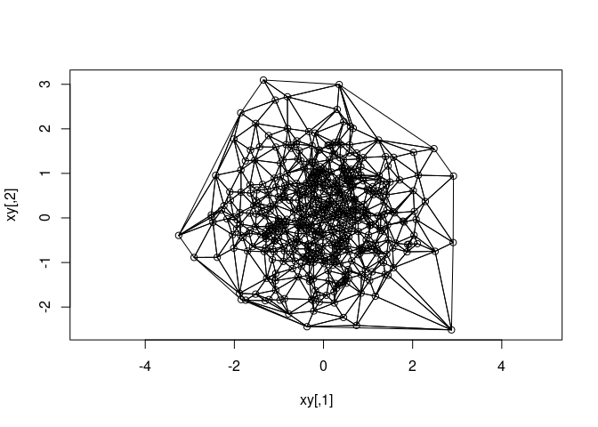

<!-- README.md is generated from README.Rmd. Please edit that file -->

# delaunator

<!-- badges: start -->
<!-- badges: end -->

The goal of delaunator is to triangulate point sets fast.

We have only wrapped this library for use in R:
<https://github.com/abellgithub/delaunator-cpp>

WIP: An old benchmark to use for comparison:

<https://rpubs.com/cyclemumner/416456>

## Installation

You can install the development version of delaunator like so:

``` r
#install.packages("remotes")
remotes::install_github("mdsumner/delaunator")
```

## Example

``` r
library(delaunator)
delaunator_triangulate(matrix(runif(6), ncol = 2))
#>      [,1] [,2] [,3]
#> [1,]    1    2    3
```

``` r

delaunator_triangulate(cbind(1:4, runif(4)))
#>      [,1] [,2] [,3]
#> [1,]    3    1    4
#> [2,]    4    2    3
#> [3,]    3    2    1
```

In the R level we sort out the orientation of inputs and outputs, and
return a matrix of triangle triplets as rows (1-based).

``` r
xy <- matrix(rnorm(1024), ncol = 2)
i <- delaunator_triangulate(xy)
plot(xy, asp = 1)
polygon(xy[t(cbind(i, NA)), ])
```



## Code of Conduct

Please note that the delaunator project is released with a [Contributor
Code of
Conduct](https://contributor-covenant.org/version/2/1/CODE_OF_CONDUCT.html).
By contributing to this project, you agree to abide by its terms.
