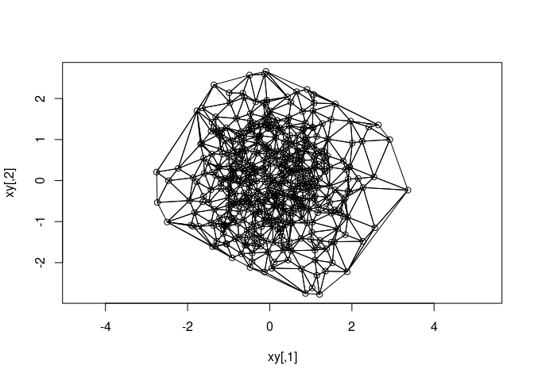

<!-- README.md is generated from README.Rmd. Please edit that file -->

# delaunator

<!-- badges: start -->
<!-- badges: end -->

The goal of delaunator is to triangulate point sets fast.

We have only wrapped this library for use in R:
<https://github.com/abellgithub/delaunator-cpp>

## Installation

You can install the development version of delaunator like so:

``` r
#install.packages("remotes")
remotes::install_github("mdsumner/delaunator")
```

## Example

``` r
library(delaunator)
delaunator_triangulate(matrix(runif(6), ncol = 2))
#>      [,1] [,2] [,3]
#> [1,]    2    3    1
```

``` r

delaunator_triangulate(cbind(1:4, runif(4)))
#>      [,1] [,2] [,3]
#> [1,]    3    4    2
#> [2,]    2    1    3
#> [3,]    3    1    4
```

In the R level we sort out the orientation of inputs and outputs, and
return a matrix of triangle triplets as rows (1-based).

``` r
xy <- matrix(rnorm(1024), ncol = 2)
i <- delaunator_triangulate(xy)
plot(xy, asp = 1)
polygon(xy[t(cbind(i, NA)), ])
```



## No constrained triangulation here

If you’re looking for constrained, conformant, or
quality-of-mesh-controllable triangulation you won’t find it here. These
features are in RTriangle on CRAN, and there is some exposure of the
CGAL library in R, and a functional version using RTriangle for some
spatial data formats is in hypertidy/anglr.

## Benchmark

WIP: An old benchmark to use for comparison:

<https://rpubs.com/cyclemumner/416456>

``` r
  n <- 150000
xy <- cbind(runif(n), runif(n))
library(delaunator)
library(geometry)
library(RTriangle)
library(tripack)
## these choices were
## 1) easy for me to try out (CGAL is todo again)
## 2) are pure Delaunay convex hull triangulation on bare points
## 3) fast enough (some are commented out)
rbenchmark::benchmark(
  delaunator = delaunator::delaunator_triangulate(xy),

  #CGAL = laridae::tri_xy(xy[,1], xy[,2]),
  geometry = geometry::delaunayn(xy, options = "Pp"),
  RTriangle = RTriangle::triangulate(RTriangle::pslg(xy)),
  tripack = tripack::tri.mesh(xy[,1], xy[,2]),
  ## too slow
  ##sf = sf::st_triangulate(sf::st_sfc(sf::st_multipoint(xy))),
  ## too slow
  #deldir = deldir::deldir(xy[,1], xy[,2], suppressMsge = TRUE),
  ## akima doesn't really belong
  #akima = akima::interpp(xy[,1], xy[,2], z = rep(0, n), xo = grid$x, yo = grid$y),
  ## spatstat belongs but was (2018) the slowest
  #spatstat = spatstat::delaunay(spatstat::ppp(xy[,1], xy[,2], window = spatstat::owin(range(xy[,1]), range(xy[,2])))),
 # rgeos = rgeos::gDelaunayTriangulation(sp::SpatialPoints(xy)),
  
  replications = 50,
  order = "relative",
  columns = c('test', 'elapsed', 'relative', 'user.self', 'sys.self')
)
#>         test elapsed relative user.self sys.self
#> 1 delaunator  13.552    1.000    13.426    0.120
#> 3  RTriangle  41.934    3.094    41.682    0.239
#> 4    tripack  89.731    6.621    89.669    0.039
#> 2   geometry 100.935    7.448    97.937    2.961
```

<sup>Created on 2024-08-12 with [reprex
v2.0.2](https://reprex.tidyverse.org)</sup>

## Code of Conduct

Please note that the delaunator project is released with a [Contributor
Code of
Conduct](https://contributor-covenant.org/version/2/1/CODE_OF_CONDUCT.html).
By contributing to this project, you agree to abide by its terms.
